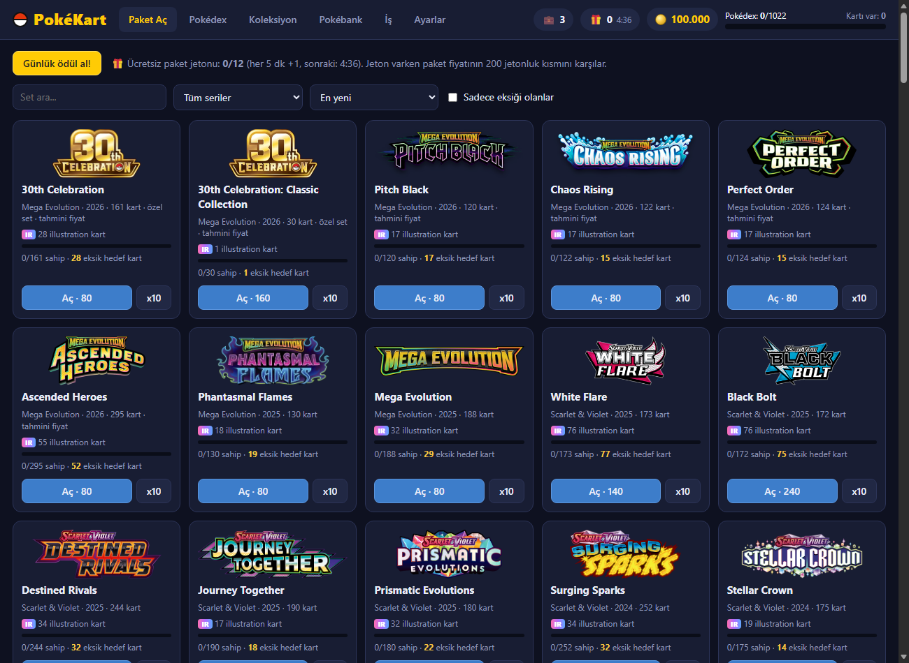
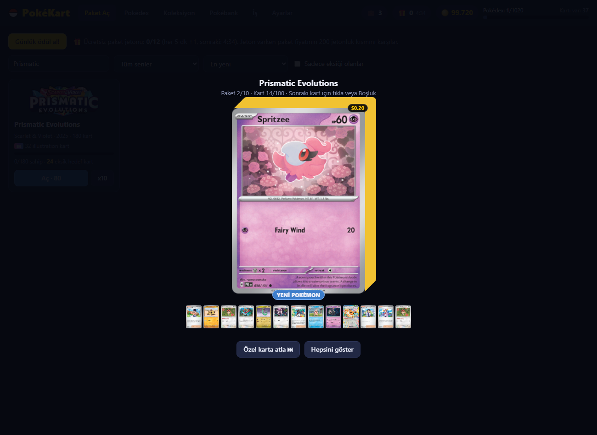
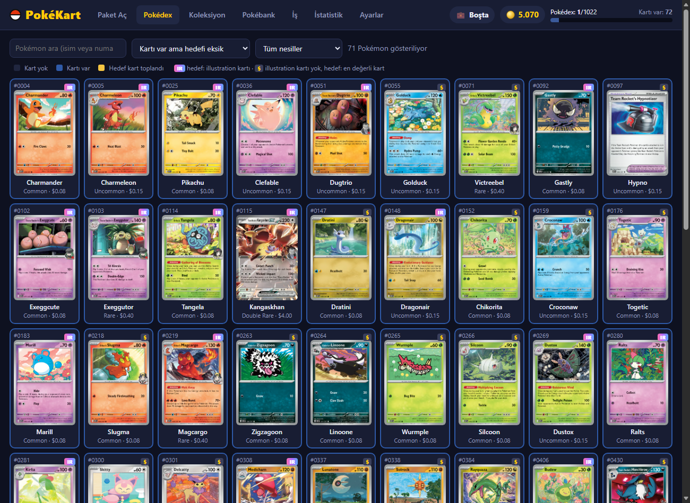
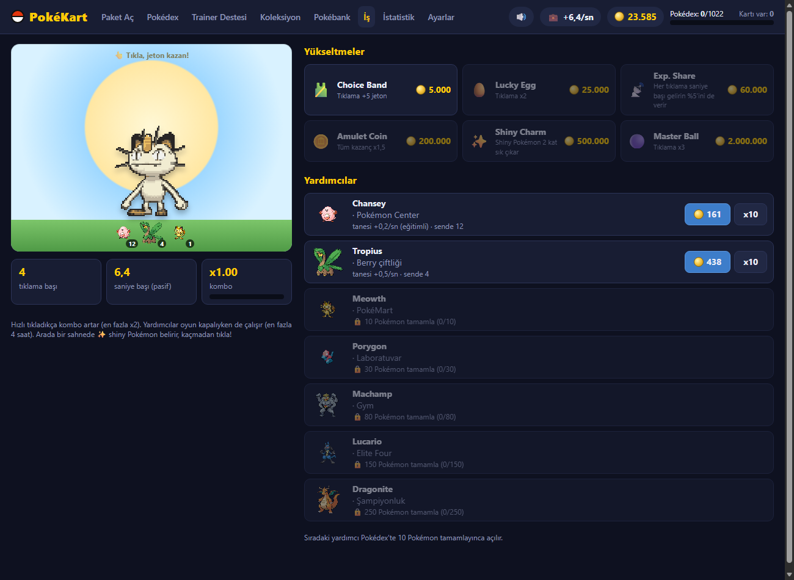
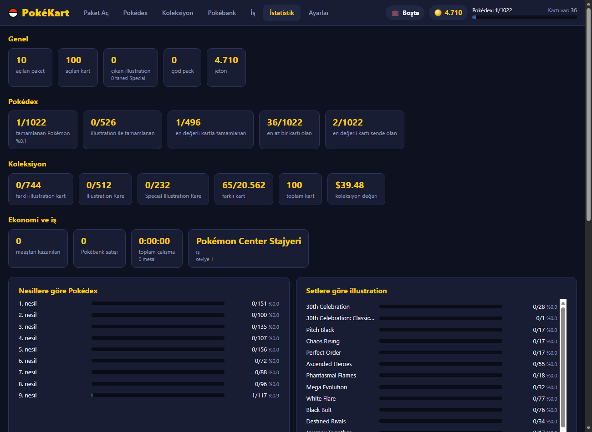

# PokéKart

Tarayıcıda çalışan, kurulum gerektirmeyen bir Pokémon kart paketi açma oyunu. Amaç her Pokémon'un **illustration kartını** toplayarak Pokédex'i tamamlamak.

- Gerçek setler ve gerçek kartlar: 1999'dan 2026'ya 167 set, 20.000'den fazla kart, 744 illustration kart
- Kart değerleri gerçek piyasa fiyatlarından (Cardmarket / TCGplayer)
- Saf HTML + JavaScript: sunucu, kurulum ya da ekran kartı gerekmez, zayıf ofis bilgisayarlarında bile çalışır

## Oynamak

`index.html` dosyasına çift tıkla (Chrome, Edge veya Firefox). Kart görselleri internetten yüklendiği için oynarken internet bağlantısı gerekir.

## Oyun

| | |
|---|---|
|  |  |
|  |  |

**Paket açma.** Her set ayrı bir paket. Paket yırtılınca kartlar deste olarak gelir ve en üstten tek tek açılır. Illustration kartlar ve değerli kartlar kapalı gelir, önce çevrilmeleri gerekir. 10'lu açmada 100 kartlık deste gelir; "Özel karta atla" butonu sıradan kartları geçer.

**Pokédex.** Hedef, her Pokémon'un Illustration Rare ya da Special Illustration Rare kartlarından birini bulmak. Illustration kartı olmayan Pokémon'larda hedef, o Pokémon'un en değerli kartı. Bulunan Pokémon'un hücresinde kartı sergilenir. Bir Pokémon'a tıklayınca hedef kartların hangi setlerde olduğu görünür.

**Trainer destesi.** Trainer kartları (Supporter, Item, Stadium, Pokémon Tool) ayrı bir destede toplanır. Aynı trainer'ın farklı baskıları tek girişte birleşir (örneğin "Professor's Research"in bütün profesör versiyonları). Hedef Pokédex'teki gibi: trainer'ın illustration versiyonu, yoksa en değerli kartı. Türe göre filtrelenebilir.

**İş.** Oyun 800 jetonla, yani 10 pakete yetecek parayla başlar; ücretsiz paket yoktur. Para kazanmak için bir mesai seçip işe gidersin: 5 dk, 15 dk, 30 dk ya da 1 saat. Her mesainin toplam maaşı baştan bellidir ve uzun mesailer daha kârlıdır. Çalışırken işe özel bir sahnede Pokémon'un çalışmasını izlersin. Sahneye tıklayarak daha hızlı çalışabilirsin: her tıklama mesaiyi biraz kısaltır, maaşı biraz artırır ve kısaltılan süre kadar ek iş deneyimi kazandırır (mesai başına en fazla -%25 süre, +%20 maaş, +%25 deneyim). Bar dolunca maaş tek seferde ödenir. İşteyken oyunda serbestçe dolaşabilirsin ama paket açamazsın; erken çıkarsan maaş alamazsın. Oyun kapalıyken de mesai devam eder. Çalıştıkça seviye atlarsın, Pokédex ilerledikçe daha iyi işler açılır.

**Pokébank.** Kart satmanın tek yolu. Common, uncommon ve $0.50 altı kartları almaz. Illustration ve Pokédex hedef kartlarının 1 kopyası her zaman sende kalır.

**Ses efektleri.** Paket yırtma, kart kaydırma ve çevirme, özel kartlar için parıltı, illustration için zil, Special Illustration için fanfar, jeton ve seviye atlama sesleri. Sesler dosyadan çalınmaz, Web Audio API ile anlık üretilir. Ayarlar'dan ses seviyesi değiştirilebilir, üst bardaki 🔊 butonuyla tamamen kapatılabilir.

**İstatistik.** Açılan paket ve kart sayısı, toplanan illustration kartlar, nesillere ve setlere göre ilerleme, kazanç ve çalışma süresi, en değerli kartların. En altta kaydı sıfırlama butonu var.

## Kayıt

İlerleme tarayıcıda (localStorage) saklanır. Başka bir bilgisayara taşımak için Ayarlar > Kaydı dışa aktar / içe aktar. Tarayıcı verilerini silersen kayıt da silinir.

## Kart verisini güncellemek

`data/cards.js` repoda hazır gelir. Yeni setleri ve güncel fiyatları almak için Windows'ta `veri-guncelle.bat` dosyasına çift tıkla (10-15 dakika sürer, ilerlemen kaybolmaz).

- Kartlar, setler ve fiyatlar [pokemontcg.io](https://pokemontcg.io) API'sinden gelir.
- Illustration kart listesi [pkmncards.com](https://pkmncards.com/rarity/illustration-rare/) ile karşılaştırılır; nadirliği yanlış girilmiş kartlar düzeltilir.
- Pokémon isimleri ve sprite'ları [PokeAPI](https://pokeapi.co)'den gelir.
- Henüz piyasa fiyatı olmayan yeni setlerde kart değerleri nadirliğe göre tahminidir.

pokemontcg.io sunucusu sık sık geçici hata verir. Script tekrar dener ve kesilirse kaldığı yerden devam eder.

## Ayarlar

Ekonomi (başlangıç jetonu, paket fiyatları, illustration çıkma oranları, maaşlar, Pokébank limiti) `game.js` dosyasının başındaki `CFG` ve `JOBS` bölümlerinden değiştirilebilir.

## Dosyalar

| Dosya | İçerik |
|---|---|
| `index.html`, `game.js`, `style.css` | Oyunun kendisi |
| `sfx.js` | Ses efektleri (Web Audio) |
| `data/cards.js` | Kart, set ve fiyat verisi (script tarafından üretilir) |
| `veri-guncelle.bat`, `veri-cek.ps1` | Veriyi internetten yeniden indirir |
| `docs/` | README ekran görüntüleri |

## Not

Kişisel, ticari olmayan bir hayran projesidir. Pokémon ve ilgili tüm isimler, görseller ve markalar Nintendo, Game Freak, Creatures Inc. ve The Pokémon Company'ye aittir. Bu proje onlarla bağlantılı değildir. Kart görselleri depoda tutulmaz, oyun çalışırken ilgili sunuculardan yüklenir.
